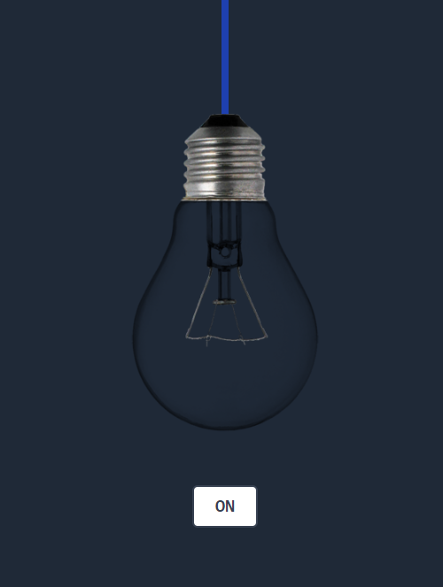
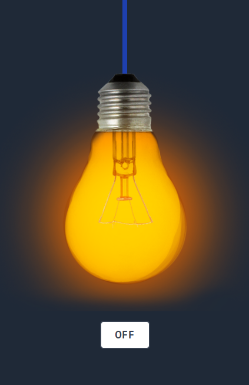

## Electric Bulb ( On | Off ) : Html, CSS ( ` Tailwind Css ` ) and JavaScript 

### Demo Link : [Go](https://sm8uti.github.io/Javascript-Projects/Electric%20Bulb/Light.html)

## Screenshots :

    
    
When Bulb is Off.

    
    
When Bulb is On.

